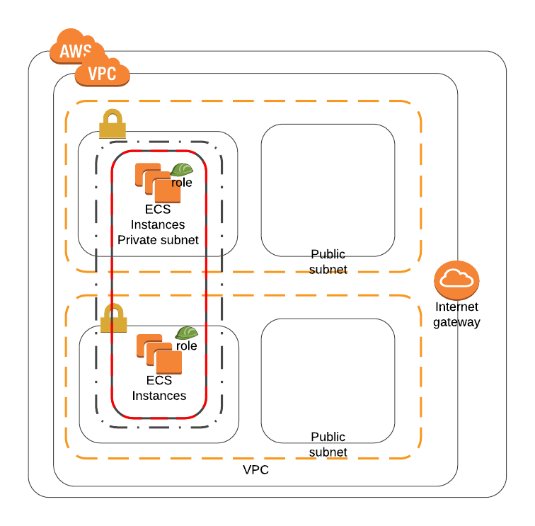
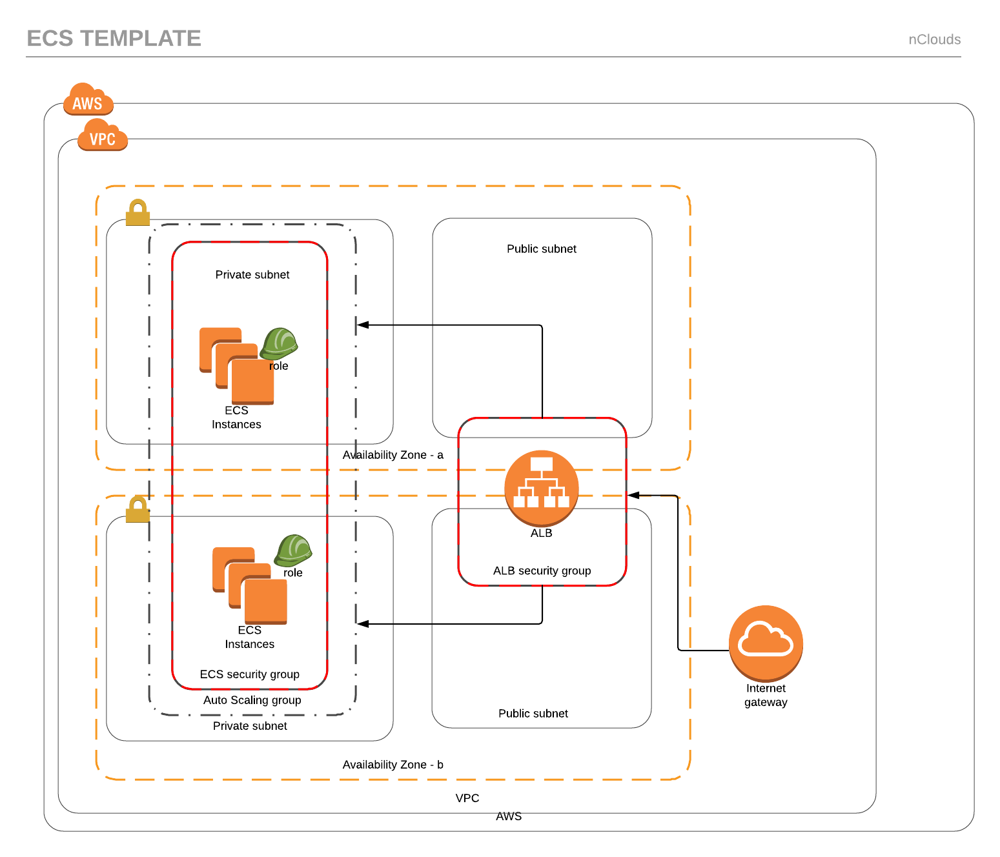

# Services

* [ALB](#loadbalancer)
* [ALBListenerRule](#listener)
* [Services](#services)

## ALB
A load balancer serves as the single point of contact for clients. The load balancer distributes incoming application traffic across multiple targets, such as EC2 instances, in multiple Availability Zones. This increases the availability of your application. You add one or more listeners to your load balancer.

Each target group routes requests to one or more registered targets, such as EC2 instances, using the protocol and port number that you specify. You can register a target with multiple target groups. You can configure health checks on a per target group basis. Health checks are performed on all targets registered to a target group that is specified in a listener rule for your load balancer.

* **ContainerPort**: Port where serivce is listening.
* **ALBPort**: Port Number

## Service
Amazon ECS allows you to run and maintain a specified number of instances of a task definition simultaneously in an Amazon ECS cluster. This is called a service. If any of your tasks should fail or stop for any reason, the Amazon ECS service scheduler launches another instance of your task definition to replace it and maintain the desired count of tasks in the service depending on the scheduling strategy used.

* **Listener**: The ALB listener
* **ImageTag**: Tag of container to launch
* **TaskCount**: Number of tasks to run in the service
* **ContainerPort**: Internal port on which the container listers
* **ContainerMemory**: Memory allocation for the container. Tasks that exceed their allocation are restarted.
* **ContainerCPU**: CPU allocation for the container. Tasks that exceed their allocation are restarted.
* **ECSCluster**: ECS Cluster to attach the service
* **ServiceName**: Used to identify task and path for load balancer rule
* **RailsECR**: ECR for rails
* **TargetGroup**: Target Group
* **VpcId**: VPC ID.
* **Cluster**: Cluster Name.
* **ServiceName**: Service Name, *needs to match service template name under service directory*
* **ServiceType**: Public or Private.
* **ContainerPort**: Container port where the service is listening.
* **LoadBalancerArn**: (Public dependent) Specifies the loadbalancer ARN.
* **LoadBalancerHttpListenerArn**: (Public dependent) Listener for HTTP connections.
* **LoadBalancerHttpsListenerArn**: (Public dependent) Listener for HTTPS connections.
* **LoadBalancerName**: (Public dependent) LoadBalancer Name.
* **Subdomain**: (Public dependent) subdomain name (subdomain.earnup.com).
* **Priority**: (Public dependent) Priority for loadbalancer.
* **VpcId**: VPC ID.

